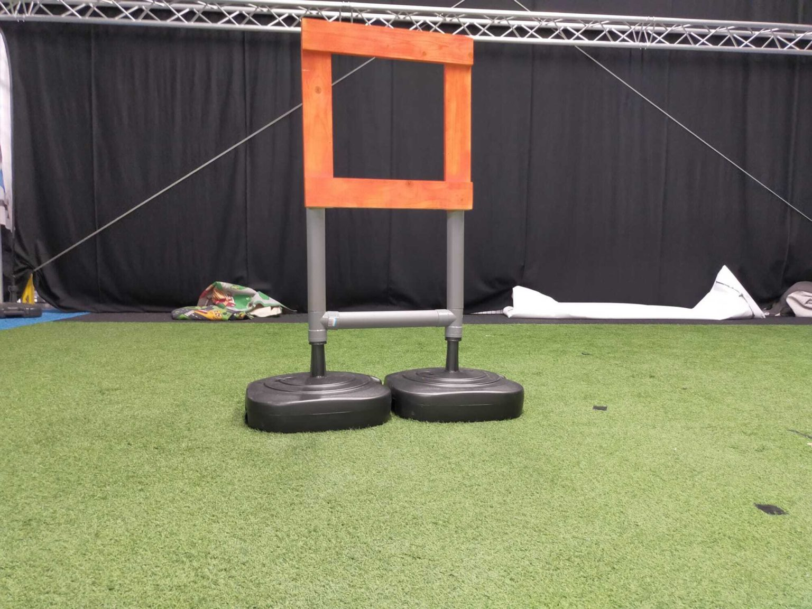

# Gate detection

This directory contains source code used during the development of the image processing algorithm for the gate detection module. Some of the inspiration for the code was derived from Dwayne Phillips's book Image Processing in C, which is available [here](https://github.com/Dwayne-Phillips/CIPS/blob/master/cips2ed.pdf).

## src directory

- `common` contains code used for reading and writing to PGM files. Not actually flashed into the AI-deck (used during initial development stages for algorithm testing on [GVSoC](https://greenwaves-technologies.com/gvsoc-the-full-system-simulator-for-profiling-gap-applications/));
- `convolution` contains functions that perform operations involving convolution on images. These are: simple convolution with 3x3 kernel, Sobel Operator and Canny Operator (the last one being the function actually used on the competition);
- `data_structures` contains code for basic data structures such as priority queues, queues, stacks and vectors;
- `filters` contains code for image filtering (Gaussian Filter and Low Pixel Filter). The Low Pixel Filter was not used in the competition;
- `morphological_operators` contains code for image morphology manipulation (Mask Erosion and Mask Dilation);
- `segmentation` contains code for thresholding images and for image segmentation via two methods: using image's edges and using image's edges + gray shades. The former was used in the competition due to its simplicity (the latter could take more than amazing 30 seconds for processing one image on the AI-deck) even though the latter is considerably more accurate. Both methods were adapted from Dwayne Phillips's book;
- `others` contains code for image histogram acquirement and manipulation, mainly for dynamically choosing boundaries for thresholding images via three methods: Histogram Peak Technique, Histogram Valley Technique and Adaptive Histogram Technique. Moreover, there is source code for determining whether a segmented region from an image constitutes a potential gate and the actual "toplevel" controller for the gate finder algorithm under the `board` directory;
- `tests` contains code for testing the algorithm with a standard C program and on [GVSoC](https://greenwaves-technologies.com/gvsoc-the-full-system-simulator-for-profiling-gap-applications/).

## include directory

Notably, the file `config.h` contains macros for configuring compilation. The rest of the files contain mostly function declarations and type definitions.

    

